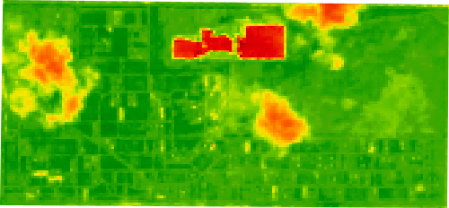

# ndvi-gee

> ndvi-gee is a typescript library for acquiring NDVI images with few clouds from a satellite database from Google Earth Engine and it returns a promise fulfilled with an object of interesting data.

[](https://www.npmjs.com/package/ndvi-gee) [](https://github.com/CapnSane/ndvi-gee) [](https://badge.fury.io/js/ndvi-gee) [](https://opensource.org/licenses/MIT) [](https://img.shields.io/npm/dt/ndvi-gee)

<br>
<div style="text-align: center;">
  <figure >
    
    <figcaption style="text-align: center;"><i>Quick Start</i> ndvi image example</figcaption>
  </figure>
</div>
<br>
<br>

## Quick Start

ndvi-gee uses geometry system to crop a satellite image, and calculate the size of the image acquired from Google Earth Engine (GEE) using a given image width in pixels, and returns an object with many interesting data.

```js
// Import the library, define your `devKey` with the `Private Key`:
const devKey = require('YOUR PRIVATE KEY');

// Define a polygon like:
const polygon = [
  {
    lat: 27.888807653809973,
    lng: -80.62262288406416
  },
  {
    lat: 27.866105444225745,
    lng: -80.62282725565235
  },
  {
    lat: 27.866415627190747,
    lng: -80.67262206251358
  },
  {
    lat: 27.889321367722737,
    lng: -80.67230056069523
  }
];

// Define the width of the polygon area in pixels:
let width = 500;

// Finally, define the dateStart and dateEnd:
let dateStart = 1617753600000;
let dateEnd = 1620518400000;

// Call the following function:
ndviGee.ndviGen(devKey, polygon, width, dateStart, dateEnd).then((result) => {
  console.log(result.img_url);
});
```

## Install

Install with npm:

```bash
npm install ndvi-gee
```

To use with node just import the module:

```js
const ndviGee = require('ndvi-gee');
```

## Usage

`ndvi-gee` acquires NDVI images with few clouds from Google Earth Engine and gives a promise with an object of interesting data.

The library uses the Google Earth Engine for acquiring the NDVI image of a region of longitude and latitude coordinates.

It is necessary passing the private key as parameter to the function. See [Private key authentication](https://developers.google.com/earth-engine/apidocs/ee-data-authenticateviaprivatekey?hl=en).

### Parameters

You can call the following function:

```typescript
ndviGee.ndviGen(devKey, polygon, width, dateStart, dateEnd).then((result) => {
  // Your code here
});
```

The parameters are described as:

| Param     | Type                         | Description                                              |
| --------- | ---------------------------- | -------------------------------------------------------- |
| devKey    | <code>Object</code>          | The JSON content of private key.                         |
| polygon   | <code>`Array<Object>`</code> | The longitude and latitude coordinates of a given map.   |
| width     | <code>Number</code>          | The width of an image in pixels.                         |
| dateStart | <code>Number</code>          | The first date in timestamp of an image collection date. |
| dateEnd   | <code>Number</code>          | The last date in timestamp of an image collection date.  |

### Return Values

The function returns a promise that is fulfilled with an object containing:

| Param      | Type                         | Description                                                                                                                                                                                                                   |
| ---------- | ---------------------------- | ----------------------------------------------------------------------------------------------------------------------------------------------------------------------------------------------------------------------------- |
| width      | <code>Number</code>          | The width of an image in pixels.                                                                                                                                                                                              |
| height     | <code>Number</code>          | The height of an image in pixels normalised by the given width. It is an rounded integer number.                                                                                                                              |
| centroid   | <code>Object</code>          | The centroid or geometric centre of a plane figure. It is the point at which a cutout of the shape could be perfectly balanced on the tip of a pin.                                                                           |
| bounds     | <code>`Array<Object>`</code> | Corners of the bounding box of the polygon.                                                                                                                                                                                   |
| time_start | <code>Number</code>          | It is set to the nominal composite start period for temporal composites. It is a `timestamp` number format.                                                                                                                   |
| time_end   | <code>Number</code>          | The ending `timestamp` is set to the nominal image acquisition time for single scenes. It is set to midnight on the day after the nominal composite end period for [MODIS](https://modis.gsfc.nasa.gov/) temporal composites. |
| index      | <code>String</code>          | The image index given by the satellite system.                                                                                                                                                                                |
| img_url    | <code>String</code>          | The NDVI cropped image `url`.                                                                                                                                                                                                 |
